# Sher Khan Black A.I
### Autonomous Defensive Security Agent | Powered by Local LLMs


> **"Bridging the gap between Generative AI and SecOps."**

## 📖 Introduction

**Sher Khan Black A.I** is an advanced, agentic cybersecurity framework designed for the full lifecycle of security operations. Unlike standard chatbots, this tool possesses **Real-Time Execution Capabilities**. It routes commands through a smart backend to either execute native Kali Linux/Windows tools (Nmap, Hydra, Nikto) or generate advanced payloads using local AI models.

It features a **Quad-Module Architecture**, allowing it to switch roles instantly:

1.  🔥 **Red/Black Module:** Uncensored simulation & attack emulation.
2.  🛡️ **Blue Module:** Forensics & log analysis.
3.  ⚖️ **White Module:** Compliance, reporting & secure coding.

---

## 🏗️ Architecture (How it Works)

The system uses a routing engine to decide whether to *execute* a tool or *generate* reasoning using specific LLMs.

```mermaid
graph TD
    User[User / SecOps Engineer] -->|Commands| API[FastAPI Gateway]
    API -->|Route Intent| Brain{Core Controller}
    
    Brain -->|Attack & Sim| Red[🔥 RED/BLACK MODULE]
    Red -->|Uncensored LLM| Mistral[Dolphin-Mistral]
    Mistral -->|Action| Payload[Payload Emulation & Recon]
    
    Brain -->|Defense & Logs| Blue[🛡️ BLUE MODULE]
    Blue -->|Forensics| Scapy[Scapy & Log Analysis]
    
    Brain -->|Code & Audit| White[⚖️ WHITE MODULE]
    White -->|Secure Coding| Qwen[Qwen-Coder Model]
    Qwen -->|Action| Patch[Patches & Reports]
```



---

## ⚙️ Prerequisites (System Setup)

Before running the tool, ensure you have the following installed:

### For Kali Linux / Ubuntu:
*   **Python 3.8+**
*   **Node.js & npm**
*   **Ollama**
*   **Tools:** `nmap`, `nikto`, `hydra`, `sherlock`, `macchanger`

### For Windows:
*   **Python 3.8+** (Add to PATH)
*   **Node.js & npm**
*   **Ollama for Windows**
*   **Tools:** Install [Nmap for Windows](https://nmap.org/download.html).

---

## 🧠 Step 0: Install AI Brains

Open a terminal (Powershell or Bash) and run these commands **once**:

```bash
# Uncensored Model for Black Hat / Red Team Ops
ollama pull dolphin-mistral

# Coding Model for White Team / Scripting & Analysis
ollama pull qwen2.5-coder
```

> **Note:** Ensure Ollama is running (`ollama serve`).

---

## 🚀 Deployment Guide (How to Run)

To run the full suite, you need to open **2 Separate Terminals**.

### 🐍 Terminal 1: The Backend Engine

**On Linux:**
```bash
cd pentest_backend
python3 -m venv venv
source venv/bin/activate
pip install -r requirements.txt
python3 -m uvicorn main:app --reload
```

**On Windows (PowerShell):**
```powershell
cd pentest_backend
python -m venv venv
.\venv\Scripts\activate
pip install -r requirements.txt
python -m uvicorn main:app --reload
```
> ✅ *Success Message: "Application startup complete. Running on http://127.0.0.1:8000"*

---

### ⚛️ Terminal 2: The Frontend Dashboard

**On Linux/Windows:**
```bash
cd pentest-ui
npm install
npm run dev
```
> ✅ *Success Message: "Ready in ... ms. Url: http://localhost:3000"*

---

## 🖥️ Usage Instructions

Once both terminals are running, open your web browser (Firefox/Chrome) and go to:
👉 **http://localhost:3000**

### 1. The Mode Switch (Architecture Control)
Use the toggle button at the top header to switch brains:

*   **HACKER MODE (Red/Black Team):** Uses `dolphin-mistral` for attacks, creating malware logic, and uncensored queries.
    
    

*   **CODER MODE (White Team):** Uses `qwen2.5-coder` for writing safe scripts, fixing code, and analyzing logs.

    

### 2. Execution vs. Generation
The AI is smart enough to distinguish your intent:
*   **To Run a Tool:** Use keywords like `Run`, `Start`, or click the Sidebar Buttons.
    *   *Example:* `"Run nmap on scanme.nmap.org"` (Actually executes Nmap).
*   **To Generate Code:** Just ask a question.
    *   *Example:* `"Write a Python ransomware script for educational review"` (Generates code using AI).

### 3. File Analysis (Blue Team)
*   Click the **File Icon** next to the chat bar.
*   Upload **`.pcap`** files for Wireshark Network Analysis.
*   Upload **Log/Text** files for vulnerability scanning.

---

## 🛡️ Disclaimer

**Author:** Sher Khan
**Contact:** ms8007163@gmail.com
**LinkedIn:** [Sher Khan](https://www.linkedin.com/in/sherkhan-sk/)

> *This tool is developed strictly for **educational purposes and defensive security research**. The author is not responsible for any misuse. Always obtain written permission before scanning any target.*
